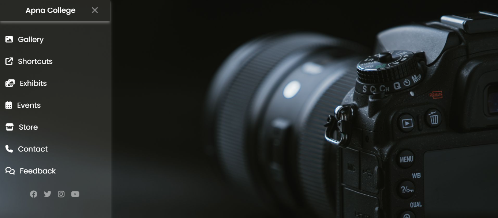

# Photography Website Sidebar

A simple sidebar UI created using HTML and CSS as part of frontend practice.

## 📌 Description
This project focuses on building a vertical sidebar layout suitable for a photography website.  
The goal was to practice CSS layout concepts and basic UI structuring.

## 🛠️ Technologies Used
- HTML5
- CSS3

## ✨ Features
- Vertical sidebar layout
- Navigation links
- Hover effects on links
- Clean and minimal design
- Responsive height using viewport units

## 🎯 What I Practiced
- CSS Box Model
- Flexbox for layout
- Spacing using margin and padding
- Basic responsive styling
- Project structure
- Git & GitHub workflow

## 📁 Project Status
Learning project (guided)

## 📸 Preview
## 📸 Preview

## 📚 Notes
This is a beginner-level project created for learning purposes.  
More features and JavaScript interactivity may be added later.
